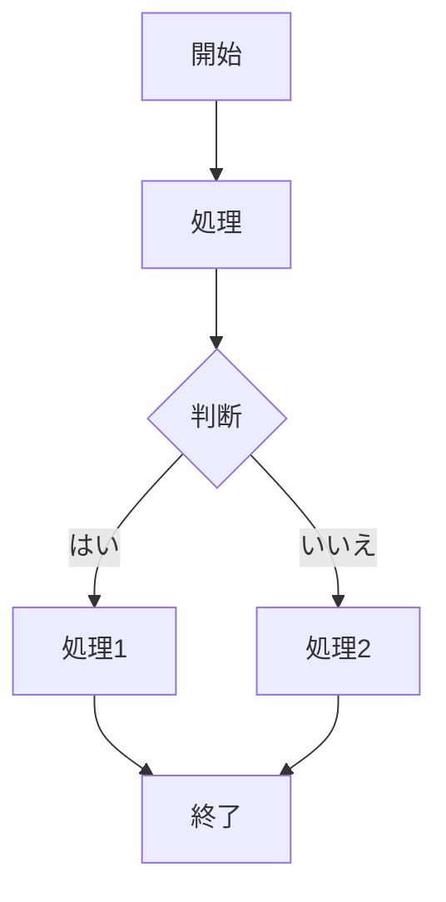
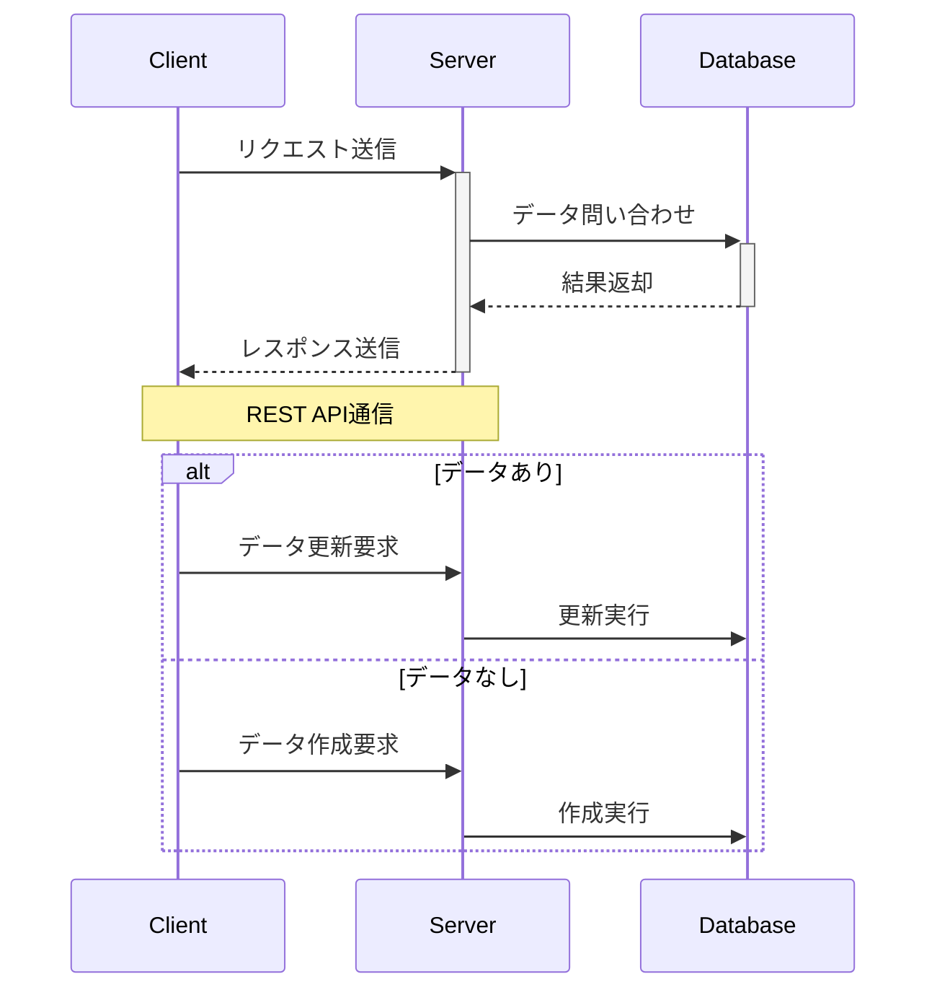
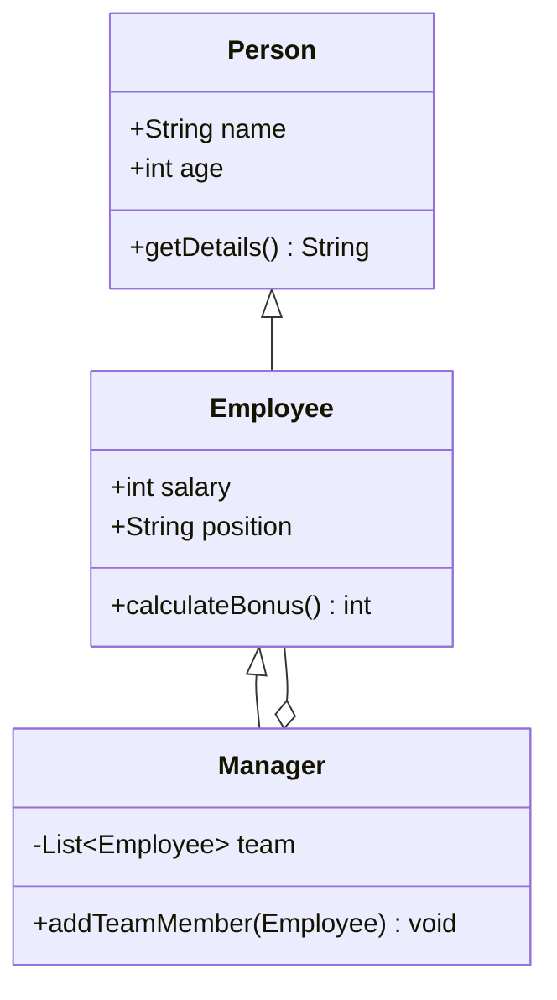
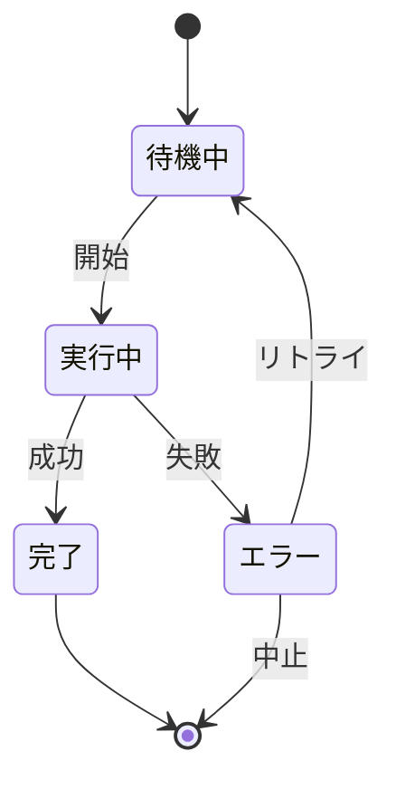
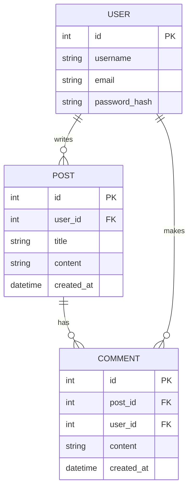
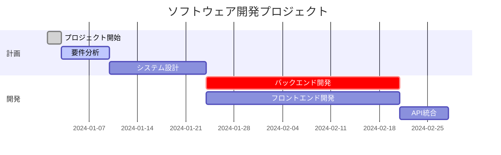
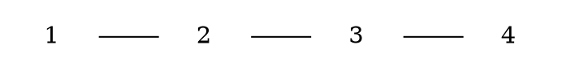
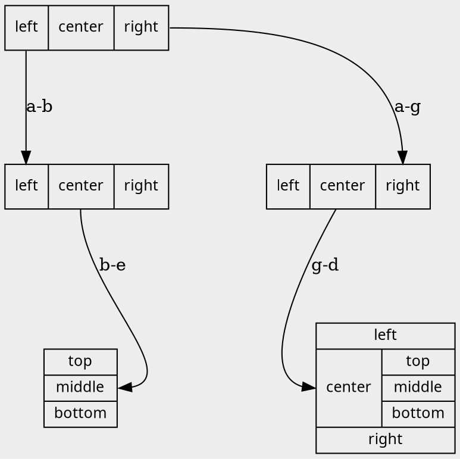

# Markdown Demo

## markmap

```markmap
## マークマップ表示デモ
マインドマップのようにマークダウンの内容を図で表現します。

### 見出しレベル3

- **見出し**:
  情報を整理するための階層構造を作成します。
- **リスト**:
  情報を箇条書きに整理します。
- **強調**:
  **太字**または*斜体*。
- `1行コードフェンス`
- コードフェンス
    ```python
    print("hello")
    ```

### リストの例

- 最初の項目
- 2番目の項目
  - 入れ子の項目 A
  - 入れ子の項目 B
- 3番目の項目

### 番号付きリストの例

1. ステップ 1: 準備
1. ステップ 2: 実行
1. ステップ 3: [リンク](https://)
1. ステップ 4: リンク先を表示

```

## mermaid

- Flowchart



- Sequence



- Crass Diagram



- State Diagram



- ER Diagram



- Gantchart



## graphviz

- Flowchart



- Record


